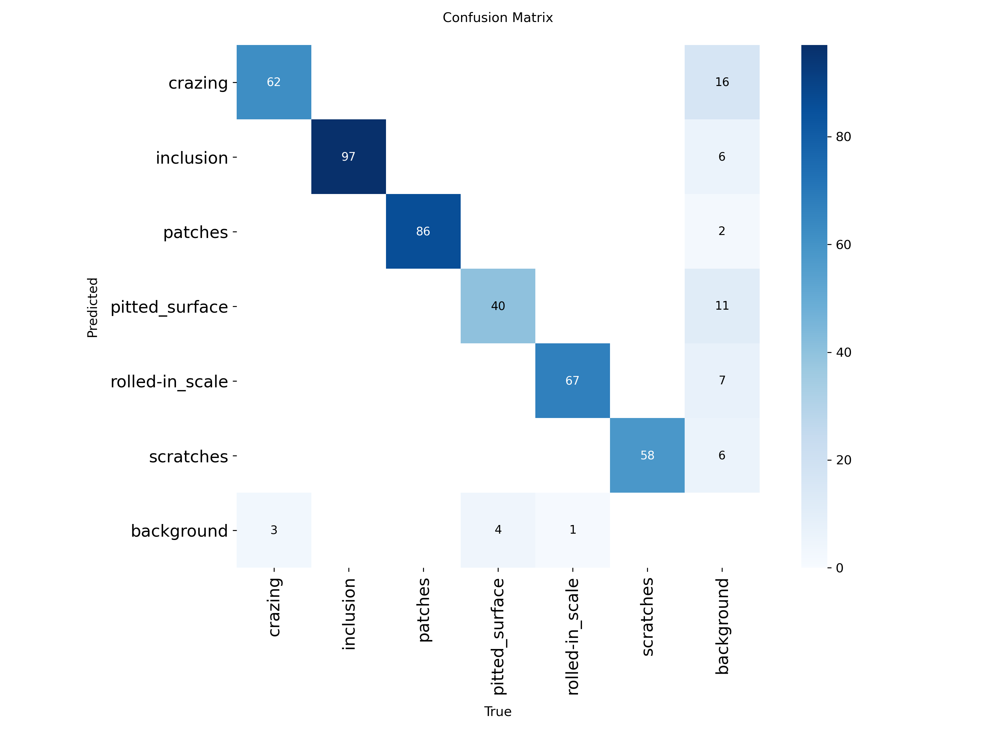
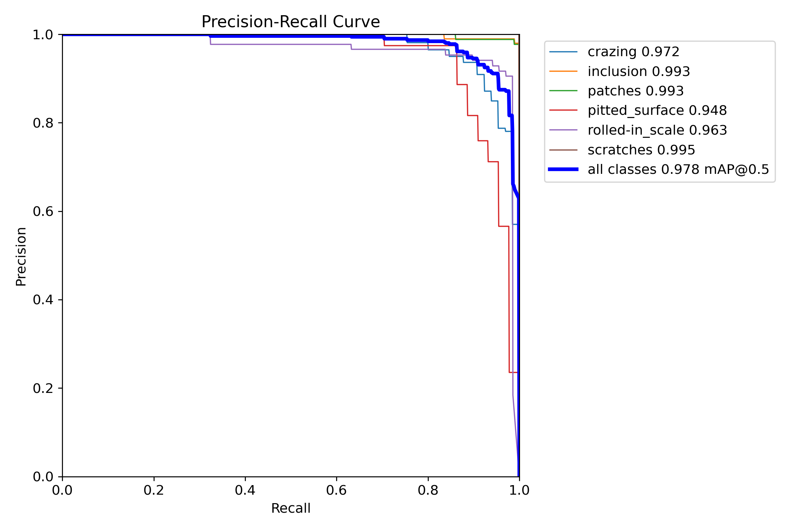
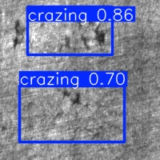
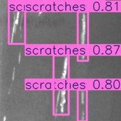

# 钢板表面缺陷检测项目（NEU-DET + YOLOv8s）

## 1. 项目简介

本项目基于 **NEU-DET 钢板表面缺陷数据集**（6 类钢板表面缺陷），构建快速、轻量的缺陷检测系统。  

采用 **YOLOv8n（baseline）** 与 **YOLOv8s（最终模型）**，并对模型的 **鲁棒性** 做了系统评估。
最终模型在验证集上达到：
- mAP50 ≈ 0.978  
- mAP50-95 ≈ 0.828  
### 🔧 主要工作

- 使用 YOLOv8n、YOLOv8s 在 NEU-DET 上训练与验证  
- 在验证集与测试集上评估 mAP50 / mAP50-95 / Precision / Recall  
- 在原始测试集上进行目标检测与结果统计  
- 对测试集构造 **亮度、对比度、噪声、旋转、平移** 等扰动，并重新生成标签  
- 对比 **Original Test vs Augmented Test** 的指标变化，分析模型鲁棒性

---

## 2. 项目目录结构（核心）

```text
Steel_Plate_Defect_Detection/
├── data.yaml                  # 原始 NEU-DET 训练/验证配置
├── data_test_aug.yaml         # 增强测试集配置（脚本自动生成）
│
├── train_neu.py               # YOLOv8n baseline 训练脚本
├── train_v8s.py               # YOLOv8s 最终模型训练脚本（200 epochs）
│
├── predict_neu.py             # 原始 test 集推理 + 保存结果
├── pred_augment_neu.py        # 增强 test 集推理 + 保存结果（可选）
│
├── augment_test_image.py      # 测试集增强 + 新标签生成
├── Robustness_Assessment.py   # 在原始/增强测试集上计算 mAP、P、R，对比鲁棒性
├── analyse_predict.py         # 对预测 CSV 做统计分析（各类置信度、每图框数等）
│
├── split_dataset.py           # 数据集划分工具（如需重新划分 train/val）
│
├── requirements.txt           # 依赖列表
│
├── weights/                   # 预训练权重（yolov8n.pt / yolov8s.pt 等）
├── runs/                      # Ultralytics 输出（loss 曲线、PR/F1、混淆矩阵、labels）
└── results/                   # 推理结果图片 + CSV
└──figures/                    #项目展示图
```

---

## 3. 环境说明（Environment Setup）

本项目开发与测试环境：

- 操作系统：Windows 10
- Python：**3.11**
- Anaconda 虚拟环境：**yolo**
- GPU：NVIDIA GeForce RTX 4060 Laptop GPU（CUDA 11.8）

### 核心依赖

详见 `requirements.txt`，主要包括：

```text
torch==2.5.0+cu118
torchvision==0.20.0+cu118
ultralytics==8.3.229
opencv-python
numpy
pandas
matplotlib
```

### 安装方式

```bash
# 创建并激活虚拟环境（示例）
conda create -n yolo python=3.11
conda activate yolo

# 安装依赖
pip install -r requirements.txt
```

如需重新安装 PyTorch，请根据本机 CUDA 情况参考官方说明：  
https://pytorch.org/get-started/locally/

Ultralytics YOLO 安装（如未安装）：

```bash
pip install ultralytics
```

---

## 4. 数据集配置（Dataset Config）

项目使用 NEU-DET 数据集，目录示例（本地）：

```text
D:/CV/NEU-DET/NEU-DET/
├── train/
│   ├── images/
│   └── labels/
├── val/
│   ├── images/
│   └── labels/
├── test/
│   ├── images/
│   └── labels/
└── test_aug_lbl/              # 脚本生成的增强测试集（images + labels）
```

### 4.1 训练/验证配置：`data.yaml`

```yaml
path: D:/CV/NEU-DET/NEU-DET
train: train/images
val: val/images

nc: 6
names: ['crazing', 'inclusion', 'patches', 'pitted_surface', 'rolled-in_scale', 'scratches']
```

### 4.2 增强测试集配置：`data_test_aug.yaml`

> 由脚本自动生成，仅 `test` 路径不同，用于鲁棒性评估。

```yaml
path: D:/CV/NEU-DET/NEU-DET
test: test_aug_lbl/images

nc: 6
names: ['crazing', 'inclusion', 'patches', 'pitted_surface', 'rolled-in_scale', 'scratches']
```

---

## 5. 模型训练（Training）

### 5.1 Baseline：YOLOv8n

```bash
python train_neu.py
```

脚本主要逻辑：

- 使用 `weights/yolov8n.pt` 作为预训练权重  
- 使用 `data.yaml` 中的 train/val  
- 训练 50 epochs  
- 结果保存在 `runs/train_neu/yolov8n_neu/`

### 5.2 Final Model：YOLOv8s（长训版本）

```bash
python train_v8s.py
```

脚本主要逻辑：

- 使用 `weights/yolov8s.pt` 作为预训练权重  
- 训练 200 epochs  
- 结果保存在 `runs/train_neu/yolov8s_neu_long/`  
- 在验证集上达到：
  - mAP50 ≈ 0.978  
  - mAP50-95 ≈ 0.828  
  - 各类 Precision/Recall 均接近 0.95 水平

训练完成后，可在 `runs/...` 中查看：

- `results.png`：loss 和指标曲线  
- `confusion_matrix.png`：混淆矩阵  
- `PR_curve.png`、`F1_curve.png`：精度-召回与 F1 曲线  
- `labels.jpg`：数据集标签分布可视化

---

## 6. 推理（Inference）

### 6.1 在原始测试集上推理

使用最终的 YOLOv8s 模型：

```bash
python predict_neu.py
```

典型功能：

- 加载 `runs/train_neu/yolov8s_neu_long/weights/best.pt`
- 对 `D:/CV/NEU-DET/NEU-DET/test/images` 全部图片推理
- 保存可视化检测结果到 `results/pred_s_xxxx/images/`
- 同时导出 `pred_results.csv` 记录：
  - `image_id, x1, y1, x2, y2, class, confidence`

### 6.2 在增强测试集上推理（可选）

```bash
python pred_augment_neu.py
```

功能类似，只是换成增强测试集目录 `test_aug_lbl/images`，并输出另一份 CSV 用于鲁棒性分析。

---

## 7. 测试集增强与标签同步（Test-Time Augmentation）

为评估模型对图像扰动的鲁棒性，使用：

```bash
python augment_test_image.py
```

主要操作：

- 从 `test/images` 读入原始测试图像  
- 对每张图像生成 6 种增强版本：
  - `_bright`：增加亮度  
  - `_dark`：降低亮度  
  - `_contrast`：提高对比度  
  - `_noise`：添加高斯噪声  
  - `_rot`：小角度旋转  
  - `_shift`：轻微平移  
- 同时根据原始 YOLO 标签，对应更新/变换 bbox 坐标  
- 保存到：

```text
D:/CV/NEU-DET/NEU-DET/test_aug_lbl/images
D:/CV/NEU-DET/NEU-DET/test_aug_lbl/labels
```

---

## 8. 鲁棒性评估（Robustness Assessment）

使用：

```bash
python Robustness_Assessment.py
```

核心步骤：

1. 使用 **同一个 YOLOv8s 模型**，在：
   - 原始测试集（`data.yaml` → `test`）
   - 增强测试集（`data_test_aug.yaml`）
   上分别运行 `model.val()`  
2. 分别得到：
   - mAP50、mAP50-95  
   - Precision、Recall  
3. 输出原始 vs 增强的差值，用于衡量鲁棒性下降程度，例如：

```text
===== Original Test =====
mAP50:     0.9824
mAP50-95:  0.8281
Precision: 0.9747
Recall:    0.9560

===== Augmented Test =====
mAP50:     0.8835
mAP50-95:  0.6447
Precision: 0.9237
Recall:    0.8154

===== 对比结果 (Aug - Orig) =====
ΔmAP50:     -0.0988
ΔmAP50-95:  -0.1833
ΔPrecision: -0.0510
ΔRecall:    -0.1405
```

---

## 9. 训练效果可视化

### 9.1 混淆矩阵（YOLOv8s, Val 集）



### 9.2 PR 曲线



### 9.3 测试集检测样例






## 10. 预测结果统计分析（Prediction Statistics）

使用：

```bash
python analyse_predict.py
```

对 `pred_results.csv` 进行统计，输出内容包括：

- 总检测框数量、涉及图片数量  
- 置信度均值 / 中位数 / 范围  
- 各类别：
  - 检测框数量  
  - 每图平均检测框数  
  - 置信度 mean / median / min / max  
- 检测框最多/最少的样本列表

---

## 11. 结果与结论（Summary）

- YOLOv8s 在 NEU-DET 上接近“满分”检测性能，在原始测试集上 mAP50 ≈ 0.98；  
- 面对亮度变化、噪声、旋转等扰动时性能有所下降，但整体 mAP 仍保持在较高水平；  
- 模型对平移扰动最鲁棒，对亮度剧烈变化相对敏感。

---

## 12. 可扩展方向（Future Work）

- 尝试 YOLOv11 / 更大 backbone，对比不同模型容量的收益；  
- 在训练阶段加入更贴近实际工业场景的数据增强；  
- 扩展到缺陷分割、异常检测等更细粒度任务；  
- 结合生产线数据，构建在线缺陷告警与质量统计系统。

